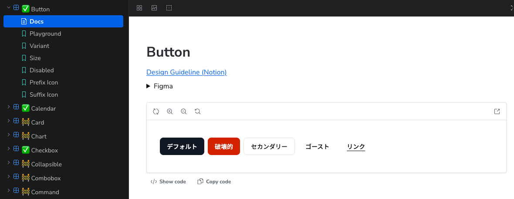

<!-- _class: lead -->


<p class="slides-label">PRESENTATION SLIDES</p>
<p class="version">[ ver.01 2026.07 ]</p>
<div class="cover-footer">
  
  <p class="description">MOSH develops and operates a platform that supports independent creators<br>in selling their services online.</p>
</div>
<p class="copyright">&copy; MOSH, Inc.</p>

# 実装をデザインガイドラインに<br>追従させるための取り組み

<p class="event-name">2026-07-31 #dip_mosh_design</p>

---
<!-- _class: split -->


<p class="copyright">&copy; MOSH, Inc.</p>

<div class="split-left">

## dachi

MOSH株式会社
Productivity / Technical Enablement

- フロントエンド基盤開発
- 技術負債の解消
- 開発組織の生産性向上
- 技術広報

<p class="note"> @dachi_023</p>

</div>
<div class="split-right">
  
</div>

---


<p class="copyright">&copy; MOSH, Inc.</p>

## 今日話すこと

- 実装がデザインに追いつかない
- ズレを解消するためにやったこと

---


<p class="copyright">&copy; MOSH, Inc.</p>

## 8分じゃ話しきれない！

気になった部分あれば懇親会などで詳しい話をさせてください :pray:

---
<!-- _class: section-cover -->


<p class="copyright">&copy; MOSH, Inc.</p>

# 実装がデザインに追いつかない

<p class="section-description"></p>

---


<p class="copyright">&copy; MOSH, Inc.</p>

## MOSHのデザインシステム

- デザインデータ: Figma（トークン、コンポーネント定義）
- ガイドライン: Notion（用途・使い分け、UXライティング、a11y）
- 実装: 社内向けUIコンポーネント群 + Storybook上でカタログ化

---


<p class="copyright">&copy; MOSH, Inc.</p>

## 課題

以下の可視化、検査、改善ができていない。

- 実装とデザインが揃っていない
    - フォント、角丸、などがデザインファイル指定の値と異なる
- デザインガイドラインに記載されているルールを網羅していない
    - 特にa11yなどは考慮漏れが発生している

---


<p class="copyright">&copy; MOSH, Inc.</p>

## なぜズレるのか？

- 情報がFigmaやNotionに分散、突き合わせコストが高い
- もともとがshadcn/uiそのままを利用するところから始まっている
    - 最初からズレている、反映しきれていない
- デザイン反映が追いついていないことによる負の連鎖
  - `className` で拡張して特定のページ内だけデザインを揃える
  - デザインが違うから共通コンポーネントが利用されない（プラットフォームの敗北）
  - などの業を積み重ねていった

---
<!-- _class: section-cover -->


<p class="copyright">&copy; MOSH, Inc.</p>

# 1. 実装とデザインの差分を検知

<p class="section-description">ズレを解消するためにやったこと</p>

---


<p class="copyright">&copy; MOSH, Inc.</p>

## 正しい状態を定義する

「デザイン通りに実装できているね！」を判断する実装上のゴールを定義。

- スタイル: Figmaで定義されたトークン、コンポーネント定義に準拠
- 内部実装: ガイドライン同様のインタフェース（Props）、a11y設計

これをAI使ってサクッと検査できるようにしたい。

---


<p class="copyright">&copy; MOSH, Inc.</p>

## `/design-context`

1. e.g. `/design-context Button`
2. Storybook MCPから各種情報を取得
    - 対象コンポーネントのStory、FigmaとNotionのURL
3. デザインデータ、ガイドラインをFigma / Notion MCP経由で取得
    - 一旦は既存資産を活用
4. コードを検査、問題があれば修正を指示

---


<p class="copyright">&copy; MOSH, Inc.</p>

## 実装

stories.tsxのJSDocにURLを記載しmetadataとしてMCP経由で取得可能にする。
コーディングエージェントにURLを取得させFigma / Notion MCP経由で取得。

```ts
/**
 * Figma: https://www.figma.com/design/...
 * Notion: https://app.notion.com/p/...
 */
const meta: Meta<typeof Button> = {
  // ...
}
```

<p class="note">
    ※ @storybook/addon-designs だと値が返ってこないのでJSDocに書いた
</p>

---


<p class="copyright">&copy; MOSH, Inc.</p>

## 実行結果

Figma / Notion / コードの突き合わせ結果が出力される。

出力サンプル：

| 対象 | あるべき値（Figma） | 現状（実装） | 差分 |
| --- | --- | --- | --- |
| 角丸 | rounded-lg | rounded-md | 適用するクラスが異なる |
| 枠線 | #222222 | #111827 | 色が異なる |
| タッチ領域 | 最低48px | 40px | 8px不足 |

ここで検知した差分を実装に反映し、デザインと実装の足並みを揃える。

---
<!-- _class: section-cover -->


<p class="copyright">&copy; MOSH, Inc.</p>

# 2. Lintによる違反検知の強化

<p class="section-description">ズレを解消するためにやったこと</p>

---


<p class="copyright">&copy; MOSH, Inc.</p>

## Biomeでカスタムルールを定義

Biomeのプラグイン機構（GritQL）で独自の違反チェッカーを実装。

例：

- 標準タグの禁止: `<h1>`〜`<h6>` ではなく `Heading` を使用
- `className` 上書きの禁止: `variant` などの専用propsを使用

今後違反が増えていくことを防止、修正に係るコストをこれ以上上げないようにする。

---


<p class="copyright">&copy; MOSH, Inc.</p>

## ルールは少しずつ増やしている

影響範囲が大きい場合は、ルールを追加。

これまでに追加したルールの一部：

| 時期 | 追加したルール |
| --- | --- |
| 2025-12 | `Text` / `Heading` への `className` 上書き禁止 |
| 2026-01 | カラーパレットに定義のない `bg-*` / `border-*` の禁止 |
| 2026-03 | `<p>` / `<h1>`〜`<h6>` への `bg-*` 指定禁止 |

---
<!-- _class: section-cover -->


<p class="copyright">&copy; MOSH, Inc.</p>

# 3. ひとつずつデザインを揃えていく

<p class="section-description">ズレを解消するためにやったこと</p>

---


<p class="copyright">&copy; MOSH, Inc.</p>

## 足元を固める

前述したSkillで効率化、カスタムルールで再発防止。

- Skill: コンポーネント単位で乖離を洗い出して修正する
- Lint: 直したパターンを二度と書けないようにする

特に再発防止のための仕組みはこの業を終わらせるためには必須。

---


<p class="copyright">&copy; MOSH, Inc.</p>

## 現在の体制

プロダクト開発の組織と並走しながら2名で分担しながら修正。

- Storybookで各コンポーネントに :white_check_mark: / :construction: をつけて完了かどうかを管理 
- 2026-07-31時点：:white_check_mark: 34ファイル (53%) / :construction: 30ファイル (47%)



---
<!-- _class: section-cover -->


<p class="copyright">&copy; MOSH, Inc.</p>

# まとめ

<p class="section-description"></p>

---


<p class="copyright">&copy; MOSH, Inc.</p>

## まとめ

- コーディングエージェントが1つのデータソースから他を辿れるよう設計
- どこの何を正とするか、を定義する
  - Figmaのトークン・コンポーネント定義、Notionのガイドラインに合わせて修正
  - 上記を前提とした差分検知の仕組み
- せっかく直したのに再発した、を無くすためのLintのカスタムルール
- 最小単位で地道にやる、コンポーネントごと、Propsごと、やりやすいやり方で

---


<p class="copyright">&copy; MOSH, Inc.</p>

## ありがとうございました :wave:


#dip_mosh_design
