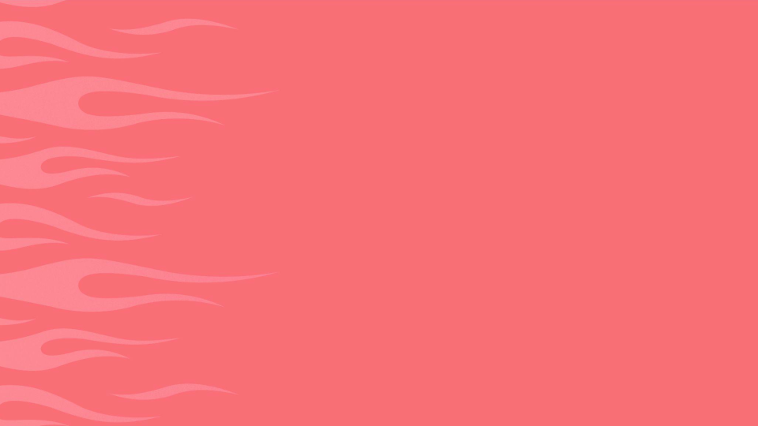

<!-- _class: lead -->


<p class="slides-label">PRESENTATION SLIDES</p>
<p class="version">[ ver.01 2026.08 ]</p>
<div class="cover-footer">
  
  <p class="description">MOSH develops and operates a platform that supports independent creators<br>in selling their services online.</p>
</div>
<p class="copyright">&copy; MOSH, Inc.</p>

# なめらかUI実装

<p class="event-name">26-08-17 社内勉強会</p>

---
<!-- _class: split -->


<p class="copyright">&copy; MOSH, Inc.</p>

<div class="split-left">

## dachi

Productivity / Technical Enablement

近況：
姪っ子にAir Jordan 1をねだられた。
叔父にねだるにしては高すぎる。

<p class="note"> @dachi_023</p>

</div>
<div class="split-right">
  
</div>

---


<p class="copyright">&copy; MOSH, Inc.</p>

## UI実装を円滑に進めるためには？

8月の週末をすべて捧げた結果分かったこと

- エージェントはTypecheckを実行するまでPropsの型を見ていない
  - `variant="primary"` とか一般的なコードで誤魔化す
  - 1画面分のモックを実装するのにだいたい30個くらいTypeErrorが出ている(taiyaki調べ)
- 効き目があったこと
  - コンポーネントの型定義をJSONなどに整形して出力
  - JSDocできちんと説明を書く
  - 実装例を提示してあげる (Storybook)

---


<p class="copyright">&copy; MOSH, Inc.</p>

## 実行結果デモ

```plain
> 実装中にTypeErrorとか出ずに進められた？

実装中の型エラーはゼロでした。

型エラーについて

bun typecheck は初回から No type errors found でした。落ちたのは Biome のフォーマットが 1 回だけで、内容は Progress の value
に書いた式の折り返し位置の違い（--write で解消）。型の問題ではありません。

inspect を見ずに書いていたら踏んでいたはずの箇所を挙げると:

- Button の variant は "link" | "default" | "destructive" | "secondary" | "ghost"。primary は存在しないので、素直に書くと落ちる
- Badge の variant は "info" | "success" | "warning" | "alert" | "neutral"。shadcn 標準の default / secondary ではない
- Chip は variant ではなく type（"filter" | "tag" | "choice"）
- Text の size は xxsm | xsm | sm | md で lg が無い。Heading は xs | sm | md | lg | xlg と別スケール
- prefixIcon の signature が (props: object) => ReactNode と出ていたので、<Plus /> ではなくコンポーネント自体を渡すと判断できた
```

---
<!-- _class: section-cover -->



<p class="copyright">&copy; MOSH, Inc.</p>

# ありがとうございました :wave:
