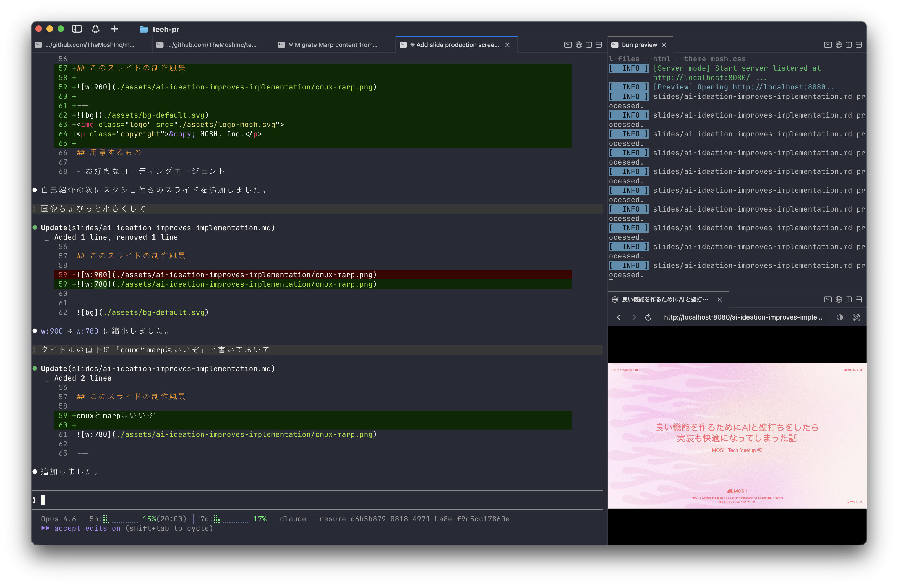

<!-- _class: lead -->

PRESENTATION SLIDES

[ ver.01 2026.03 ]

  
  
MOSH develops and operates a platform that supports independent creators in selling their services online.

&copy; MOSH, Inc.

# 良い機能を作るためにAIと壁打ちをしたら 実装も快適になってしまった話

MOSH Tech Meetup #3

---
<!-- _class: split -->

&copy; MOSH, Inc.

## dachi

MOSH株式会社

- フロントエンド基盤開発
- 技術負債の解消
- 開発組織の生産性向上
- 社内ツール開発
- 技術広報

 @dachi

  

---

&copy; MOSH, Inc.

## このスライドの制作風景

cmuxとmarpはいいぞ

---

&copy; MOSH, Inc.

## 用意するもの

- お好きなコーディングエージェント
- GitHub CLI

---

&copy; MOSH, Inc.

## エージェントに何かを依頼するとき

当たり前だがやりたいことが明確であればブレは減る

### よくない依頼の仕方

「ユーザーの今月の売上を表示するページを作成して」

- 消費税は？
- 日毎の売上は？
- 振込状況は？

---

&copy; MOSH, Inc.

## Issueの質を上げるために

最近ハマってるやり方

1. Issueを作成する (titleだけでもOK)
2. 「{org}/{repo}/issues/{num} の詳細を決めたいので壁打ちして」
3. やりとりしつつ流れの中でIssueをアップデートさせ続ける
4. できあがり

あとは「このIssueの実装を進めて」で実装を開始してもらう。

---

&copy; MOSH, Inc.

## AIと壁打ちする良さ

対話の中で以下のような情報が整理されていく

- スコープを明確にすることでPRの肥大化を防止
- 技術選定や実装方針を文書化する
- 受け入れ条件を定義し何をテストすべきか？を明確にする

---

&copy; MOSH, Inc.

## 実装する時に嬉しいこと

- AIの実装がスムーズ、一発でうまく実装できる可能性が上がる
- なんか違うな？となった時に別セッションでリトライするのが楽
- レビュアーに実装の意図を伝えやすい

---

&copy; MOSH, Inc.

## Issue以外に揃っていると良いもの

以下のような情報がまとまっていると更に賢くなる

- AGENTS.md, CLAUDE.md などリポジトリ全体についてまとまっているもの
- ADR, Design Docなどの過去の意思決定が分かるもの

---

&copy; MOSH, Inc.

## その他Tips

- Issue templateで組織内での品質を均一化する
- 壁打ちの過程で重要な意思決定などはDesign Doc等に切り出すなども検討する
- Issueが完成したら：
    - 別セッション立ち上げて「検討漏れや決めたほうがいいことを確認して」と聞く
    - ↑ 初回とは違うモデルに依頼するのも効果的

---
<!-- _class: section-cover -->

&copy; MOSH, Inc.

# 👋

ありがとうございました

