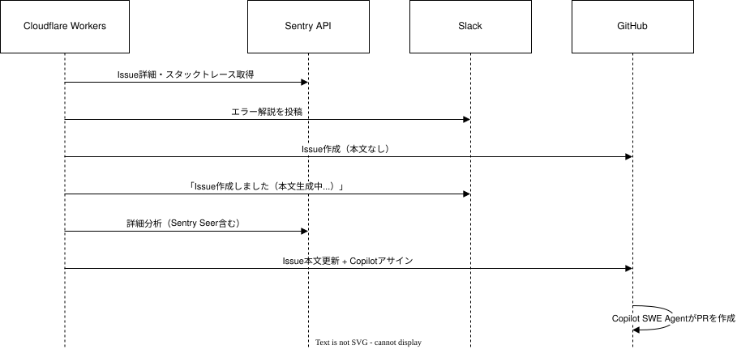
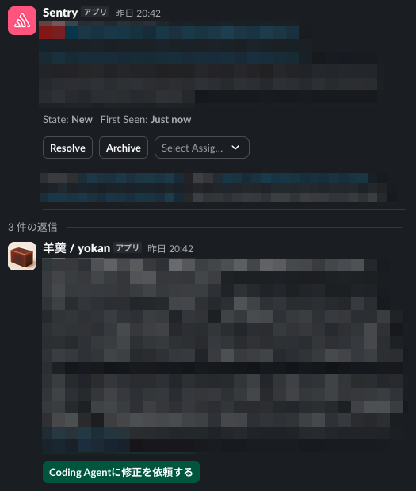

<!-- _class: lead -->

PRESENTATION SLIDES

[ ver.01 2026.03 ]

  
  
MOSH develops and operates a platform that supports independent creators in selling their services online.

&copy; MOSH, Inc.

# アプリエラーの対応を自動化したい

MOSH x RABO x AnotherBall 勉強会

---
<!-- _class: split -->

&copy; MOSH, Inc.

## dachi

MOSH株式会社
Technical Enablement ユニット

- フロントエンド基盤開発
- 技術負債の解消
- 開発組織の生産性向上
- 社内ツール開発
- 技術広報

 @dachi_023

  

---

&copy; MOSH, Inc.

## この発表について

Sentryの通知をトリガーにIssueの作成とPRの作成を自動化するワークフローを構築。

- なぜ必要か
- ワークフローの設計
- 作ってみた感想

---
<!-- _class: section-cover -->

&copy; MOSH, Inc.

# 背景・課題

---

&copy; MOSH, Inc.

## エラー対応：従来のフロー

1. Sentryがエラーを検知する
2. Slackに通知が届く
3. エラー内容を確認し対応すべきかどうかを判断
4. 担当者が作業、その後リリース

**課題**
- 検知から内容の理解までに時間がかかる場合がある
- シンプルな不具合でも人手が必要でそれなりのコストがかかる
- 日頃から通知が多いと対応が雑になる

---

&copy; MOSH, Inc.

## エラー対応：こうなりたい

1. Sentryがエラーを検知する
2. Slackに通知が届く
3. 自動でIssueが作成され、CopilotがPRを作成する
4. 人がレビューしマージ、リリース

**改善**
- AIがエラー内容を要約、エラーの内容をすぐに理解できる
- 初動対応はCopilotが実施するのでコードレビューだけで済む
- 雑なArchive, Resolveが減る(減って欲しい)

---
<!-- _class: section-cover -->

&copy; MOSH, Inc.

# ワークフロー設計・実装

---

&copy; MOSH, Inc.

## コンポーネント

| コンポーネント | 役割 |
|--------------|------|
| Sentry | エラー検知、Seerによるエラー解析 |
| Slack | 通知、ワークフロー開始の起点 |
| Cloudflare Workers | エラー解析(OpenAI + Sentry Seer)、GitHub Issue作成 |
| GitHub SWE Copilot | Issueの内容から修正PRを作成 |

---

&copy; MOSH, Inc.

## 処理の流れ

---

&copy; MOSH, Inc.

## Cloudflare Workersの中

### 自動で調査

1. Slackイベントを受信、Cloudflare Queueにenqueue
    - fetch handlerは30秒でタイムアウト、queue handlerは15分
2. AI agent (gpt-5-nano)がSentry APIでエラー情報を収集
3. 調査結果をSlackに投稿

---

&copy; MOSH, Inc.

### Issueの作成

1. GitHub Issueを作成
2. Cloudflare Queueにenqueue
3. AI agentがSentry Seerの分析結果などを材料にIssue本文を生成
4. Issueを更新後、Copilot SWE Agentをアサイン

---
<!-- _class: section-cover -->

&copy; MOSH, Inc.

# 作ってみた感想

---

&copy; MOSH, Inc.

## エラー対応が少し気楽になった

- エラー解説、Issueの作成など初動は速く出来そう
- 原因がシンプルであればCopilotの修正だけで十分なものもある
- レビューしてリリースすればいい

---

&copy; MOSH, Inc.

## 課題

- Issueの質のみがPR作成の成功を決める
    - Seerは結構検討違いなことを言う
    - Workers内のエージェントにコード検索させる方が良い説
- Sentry内のノイズを減らさないとIssueが無駄に増える
    - 現状はノイズが多いのでIssue作成は任意にした
- 人がレビューする部分はまだ外せない
    - Issueの精度問題があり、信頼できないケースがあった

---
<!-- _class: split -->

&copy; MOSH, Inc.

## 今の落とし所

- 解析させるのはデフォでやる
- Issue作るかどうかは人が決める
- Issue作ったらCopilotが動く

  

---

&copy; MOSH, Inc.

## まとめ

- アプリエラーを検知しつつAIに勝手に対応させるためのフローを構築
- エラーの解説やIssue作成などを自動化することで人の負担を軽減
- ノイズや原因分析の精度を高めれば完全自動化もできそう

---
<!-- _class: section-cover -->

&copy; MOSH, Inc.

# 👋

ありがとうございました

